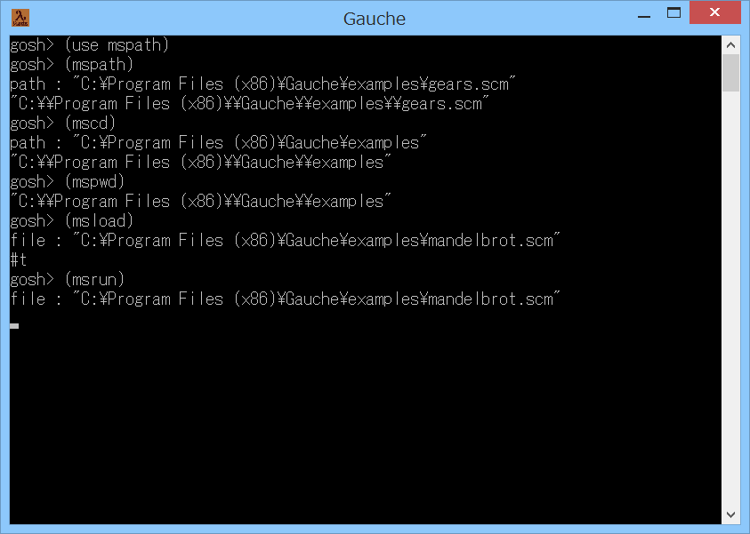

# mspath



## 概要
- Gauche の REPL 上で、Windows のパス名をそのまま読み込むためのモジュールです。

- Windows のコマンドプロンプトで Gauche の REPL を実行している場合、  
  .scm ファイル等を、マウスでドラッグ&ドロップすると、パス名が表示されます。  
  しかし、パス名の区切りの円記号 (もしくはバックスラッシュ) は、  
  文字列のエスケープ記号と認識されるため、うまく読み込むことができません。  
  本モジュールは、このパス名をそのまま読み込むための、補助ツールとして作成したものです。

- その後、MSYS2 の mintty 上でも使用できるように msys- 系の命令を追加しました。


## インストール方法
- mspath.scm を Gauche でロード可能なフォルダにコピーします。  
  (例えば (gauche-site-library-directory) で表示されるフォルダ等)


## 使い方
```
  (use mspath) ; モジュールをロードします。

  (mspath)     ; 実行すると入力待ちになります。
               ; Windows のパス名を入力すると、文字列に変換します。
               ; パス名は、ファイルをドラッグ&ドロップして入力できます(※1)。
  (mscd)       ; mspath でパス名を入力後、cd (sys-chdir) を行います。
  (mspwd)      ; pwd を行います (sys-getcwd の単なるエイリアスです)。
  (msload)     ; mspath でパス名を入力後、ロードを行います。
  (msrun)      ; mspath でパス名を入力後、ロードを行い、main 手続きを実行します。


  (mspath '(c:\work\aaa.txt))
               ; 引数で渡した Windows のパス名(※2)を文字列に変換します。
  (mscd   '(c:\work))
               ; mspath でパス名を変換後、cd (sys-chdir) を行います。
  (msload '(c:\work\bbb.scm))
               ; mspath でパス名を変換後、ロードを行います。
  (msrun  '(c:\work\ccc.scm))
               ; mspath でパス名を変換後、ロードを行い、main 手続きを実行します。


  (msys-path)  ; 実行すると入力待ちになります。
               ; MSYS のパス名を入力すると、Windowsのパス名に変換します。
               ; パス名は、mintty 上にファイルをドラッグ&ドロップして入力できます(※3)。
               ; 実行には、外部プログラムの cygpath が必要です。
  (msys-cd)    ; msys-path でパス名を入力後、cd (sys-chdir) を行います。
  (msys-pwd)   ; pwd を行います (sys-getcwd の単なるエイリアスです)。
  (msys-load)  ; msys-path でパス名を入力後、ロードを行います。
  (msys-run)   ; msys-path でパス名を入力後、ロードを行い、main 手続きを実行します。


  (msys-path "/c/work/aaa.txt")
               ; 引数で渡した MSYS のパス名(※4)を文字列に変換します。
               ; 実行には、外部プログラムの cygpath が必要です。
  (msys-cd   "/c/work")
               ; msys-path でパス名を変換後、cd (sys-chdir) を行います。
  (msys-load "/c/work/bbb.scm")
               ; msys-path でパス名を変換後、ロードを行います。
  (msys-run  "/c/work/ccc.scm")
               ; msys-path でパス名を変換後、ロードを行い、main 手続きを実行します。


  (※1)このパス名は、ダブルクォートで囲われていてもいなくてもかまいません。
       例えば、以下のように変換されます。
         c:\work\aaa.txt    → "c:\\work\\aaa.txt"

  (※2)このパス名は、ダブルクォートではなくて '() で囲って渡す必要があります。
       例えば、以下のように変換されます。
         '(c:\work\aaa.txt) → "c:\\work\\aaa.txt"

  (※3)このパス名は、ダブルクォートで囲われていてもいなくてもかまいません。
       例えば、以下のように変換されます。
         /c/work/aaa.txt    → "C:\\work\\aaa.txt"

  (※4)このパス名は、ダブルクォートで囲って渡す必要があります。
       例えば、以下のように変換されます。
         "/c/work/aaa.txt"  → "C:\\work\\aaa.txt"
```


## 注意事項
1. Windowsのパス名を引数で渡した場合には、シンボルのリストを、1個ずつ文字列に変換しています。  
   しかし、この方法では、空白文字が連続するようなパス名をうまく変換できません。  
   (空白文字がひとつにまとめられてしまう)  
   このような場合には、空白文字が連続する部分のみを " " または | | で囲ってください。  
   (例えば `(mspath '(x|  |y))`  等)


## 環境等
- OS
  - Windows 8.1 (64bit)
- 言語
  - Gauche v0.9.4
  - Gauche v0.9.5_pre1

## 履歴
- 2016-4-21 v1.00 (初版)
- 2016-4-21 v1.01 コメント修正等
- 2016-4-23 v1.02 パス名の省略時に入力待ちになるようにした
- 2016-4-23 v1.03 正規表現一部修正
- 2016-4-25 v1.04 msys- 系の命令を追加
- 2016-4-25 v1.05 一部処理を手続き化
- 2016-4-25 v1.06 cd, pwd の機能を追加
- 2016-4-25 v1.07 空文字列の処理を追加
- 2016-5-29 v1.08 mspathとmsys-pathにプロンプト指定のオプション引数を追加
- 2016-5-29 v1.09 プロンプト表示見直し
- 2016-5-30 v1.10 Windowsのパス名の引数で、空白文字が連続する場合の暫定対策


(2016-5-30)
